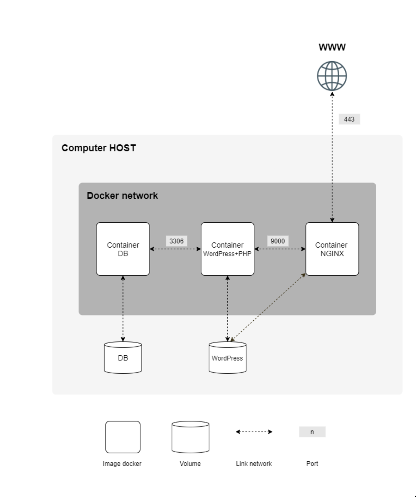

# Inception


```
.
├── diagram.png
├── .gitignore
├── Makefile
├── README.md
└── srcs
    ├── docker-compose.yml
    ├── .env
    └── requirements
        ├── mariadb
        │   ├── conf
        │   │   └── mariadb-server.cnf
        │   ├── Dockerfile
        │   ├── entrypoint.sh
        │   └── tools
        │       └── init-db.sh
        ├── nginx
        │   ├── conf
        │   │   └── default.conf
        │   ├── Dockerfile
        │   └── entrypoint.sh
        └── wordpress
            ├── conf
            │   └── www.conf
            ├── Dockerfile
            ├── entrypoint.sh
            ├── sources
            │   └── resume.html
            └── tools
                └── wp-config.sh
```
```
  $ git clone https://github.com/clemedon/inception
  $ cd inception
  $ make
  Wait…
  $ firefox inception.fr
